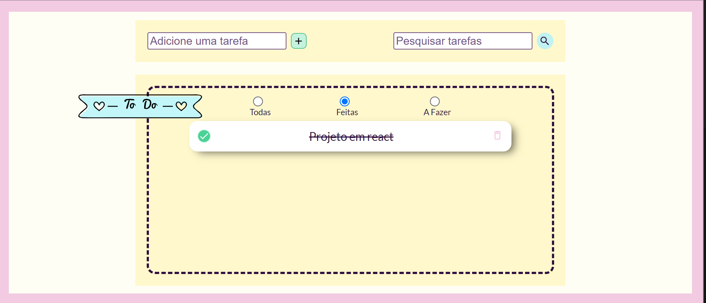

# 📅 To-Do List

Este é um projeto de um site de organização de tarefas (to-do list) construído com React JS, JavaScript e Styled Components.



## Descrição

- Este aplicativo permite que você adicione, edite e exclua tarefas.
- Você pode aplicar filtros para visualizar todas as tarefas, tarefas concluídas ou tarefas pendentes.
- Há também uma funcionalidade de pesquisa para encontrar tarefas específicas.

## Ferramentas Utilizadas

- React JS
- JavaScript
- Styled Components
- React Icons

## Como Testar

Você pode acessar o projeto online aqui: [To-Do List App](https://todo-einsenhower.vercel.app/)

Ou, se preferir, pode rodá-lo localmente em sua máquina:

```bash
git clone "https://github.com/DeniCosta/todo-einsenhower.git"
```
```bash
cd todo-app
```
```bash
npm install
```
```bash
npm run dev
```

## Decisões do Projeto

**1. Estado da Aplicação:**
   - O estado das tarefas é gerenciado localmente usando o `useState` do React.

**2. Adicionar Tarefa:**
   - As tarefas são adicionadas através de um formulário.
   - Cada tarefa é identificada por um ID gerado aleatoriamente.

**3. Remover Tarefa:**
   - As tarefas podem ser excluídas individualmente por meio da função `removeTask`.

**4. Concluir Tarefa:**
   - As tarefas podem ser marcadas como concluídas ou não concluídas através da função `toggleItemCompleted`.

**5. Filtros:**
   - Os filtros permitem que o usuário visualize todas as tarefas, apenas as tarefas concluídas ou apenas as tarefas pendentes.

**6. Pesquisa:**
   - O campo de pesquisa permite ao usuário encontrar tarefas com base em seus títulos.

**7. Estilização:**
   - A estilização é feita usando Styled Components para criar um design atraente e responsivo.
